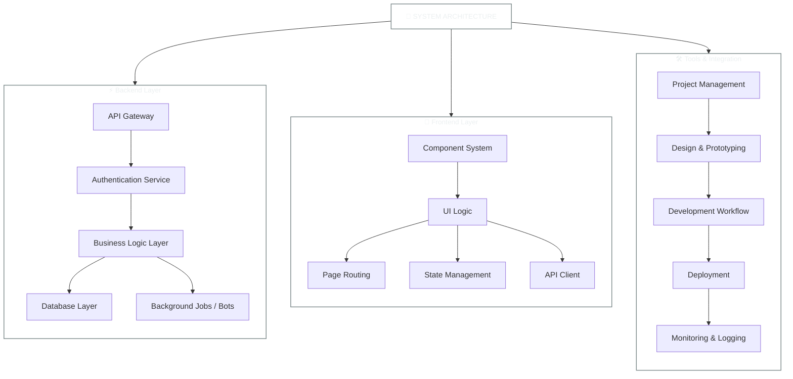

# 🚀 HOLYCANN • Full Stack Developer

---

## 🌐 **SYSTEM ARCHITECTURE**

---

## 🛠️ **TECHNOLOGY STACK** 

## 🛠️ TECHNOLOGY STACK

### **⚡ Core Development**

### **🔥 Frameworks & Libraries**

### **🗄️ Database Systems**

### ⚙️ Platforms & CMS

### **🧰 Tools & Workflow**

---

## 📊 **PERFORMANCE DASHBOARD**

### **⚡ Development Statistics**

### **🔥 Code Distribution Matrix**

### **📈 Contribution Activity**

---

## 🚀 **DEVELOPMENT PHILOSOPHY**

  <h3 style="color:#00adb5;">🎯 Core Principles</h3>
  <ul style="list-style: none; padding-left: 0;">
    <li>🧠 <strong>SOLID & DRY by Default</strong></li>
    <li>🧩 Modular & Reusable Components</li>
    <li>⚙️ Clear Separation of Concerns</li>
    <li>📄 Documentation as a Habit</li>
    <li>🧪 Testable & Maintainable Code</li>
  </ul>

  <h3 style="color:#00adb5;">🚧 Mindset & Approach</h3>
  <ul style="list-style: none; padding-left: 0;">
    <li>🔁 24/7 Automation (Bots & Background Jobs)</li>
    <li>📊 Data-Driven Problem Solving</li>
    <li>🎯 Clarity in System Design & Flow</li>
    <li>🌐 Dev Experience = User Experience</li>
    <li>🔄 Always Iterating, Never Settling</li>
  </ul>

---

## 🌐 **PROFESSIONAL NETWORK**

---

### 💫 **Building Intelligent Systems with Purpose**

---

⚙️ Engineered with logic and intent • Evolving through clarity, efficiency, and automation ⚡

