# 🚀 HOLYCANN • Full Stack Developer

<div align="center">


---

</div>

## 🌐 **SYSTEM ARCHITECTURE**

```mermaid
graph TD
    %% Root
    A[🧠 HOLYCAN'S SKILL MAP] --> Backend
    A --> Tools
    A --> Frontend

    %% BACKEND SYSTEMS
    subgraph Backend [⚡ BACKEND SYSTEMS]
        direction TB
        BE1[Go]
        BE2[Node.js]
        BE3[PHP]
        BE4[RESTful APIs]
        BE5[Firebase]
        BE6[Database]

        BE1b[SOLID & DRY]
        BE1c[Separation of Concerns]

        BE3 --> BE3a[Laravel]

        BE5 --> BE5a[Authentication]
        BE5 --> BE5b[Firestore]

        BE6 --> BE6a[PostgreSQL]
        BE6 --> BE6b[MySQL/MariaDB]
        BE6 --> BE6c[Firebase]
    end

        %% TOOLS & PLATFORM
    subgraph Tools [🛠 TOOLS & PLATFORM]
        direction TB
        T1[Github]
        T3[Wordpress]
        T2[ClickUp]
        T6[Excel / Spreadsheet]
        T7[Figma]
        T8[Canva]
    end

    %% FRONTEND
    subgraph Frontend [🎨 FRONTEND]
        direction TB
        FE1[React.js]
        FE2[HTML + CSS]
        FE3[JavaScript]
        FE4[PHP]

        FE1 --> FE1a[Next.js]
        FE1 --> FE1b[Vite]

        P5[Reusable Components]
        P6[Modular Frontend]
    end

    %% Styling (futuristic minimalist look)
    classDef clean fill:none,stroke:#7f8c8d,stroke-width:1.5px,color:#ecf0f1,font-size:14px;
    class Backend,Frontend,Tools clean;
    class A clean;
```



---

## 🛠️ **TECHNOLOGY STACK** 

<div align="center">

### **⚡ Core Development**


### **🔥 Frameworks & Libraries**


### **🗄️ Database Systems**


### **☁️ Cloud & DevOps**


</div>

---

## 📊 **PERFORMANCE DASHBOARD**

<div align="center">

### **⚡ Development Statistics**


### **🔥 Code Distribution Matrix**


### **📈 Contribution Activity**


</div>

---

## 🌟 **TECHNICAL SPECIALIZATIONS**

<table width="100%">
<tr>
<td width="50%" valign="top">

### 🖥️ **Backend**
- **RESTful API Design**
- **Real-time Systems** with WebSockets

</td>
<td width="50%" valign="top">

### 🎨 **Frontend**
- **Modern React** ecosystems

</td>
</tr>
<tr>
<td width="50%" valign="top">

### 🗄️ **Database**
- **Multi-database** architecture
- **Real-time Synchronization** with Firebase

</td>
<td width="50%" valign="top">

### ☁️ **Cloud**
- **Containerization** with Docker

</td>
</tr>
</table>

---

## 🚀 **DEVELOPMENT PHILOSOPHY**

<div align="center">

```yaml
Core_Principles:
  - 🎯 Clean, Maintainable Code
  - ⚡ Performance-First Approach
  - 🔒 Security by Design
  - 📱 Mobile-Responsive Solutions
  - 🌐 Cross-Platform Compatibility

Innovation_Focus:
  - 🤖 Automated Testing & QA
  - 📊 Data-Driven Architecture
  - 🔄 Continuous Integration
  - 📈 Scalable System Design
```

</div>

---

## 🌐 **PROFESSIONAL NETWORK**

<div align="center">

[](https://linkedin.com/in/yourprofile)
[](https://yourportfolio.com)
[](mailto:your.email@domain.com)
[](https://github.com/holycann)

</div>

---

<div align="center">

### 💫 **Engineering the Future Through Code**


</div>

---

<div align="center">
<sub>🌟 Crafted with precision and passion • Always evolving, always improving 🌟</sub>
</div>
