# 🚀 HOLYCANN • Digital Architect & Code Alchemist

<div align="center">

```ascii
    ╭─────────────────────────────────────────────╮
    │  ◢◤ WELCOME TO THE FUTURE OF DEVELOPMENT ◢◤  │
    ╰─────────────────────────────────────────────╯
```


---

### ⚡ **QUANTUM STATS MATRIX**


</div>

---

## 🌐 **SYSTEM ARCHITECTURE**

```mermaid
graph TD
    A[🧠 NEURAL CORE] --> B[⚡ Backend Systems]
    A --> C[🎨 Frontend Interfaces] 
    A --> D[🔗 Blockchain Layer]
    B --> E[Go Microservices]
    B --> F[API Gateways]
    C --> G[React Ecosystems]
    C --> H[Interactive UIs]
    D --> I[Web3 Integration]
    D --> J[Smart Contracts]
```



---

## 🛠️ **TECH ARSENAL** 

<div align="center">

### **⚡ Core Languages**


### **🔥 Frameworks & Libraries**


### **🌐 Web3 & Blockchain**


### **🗄️ Databases & Cloud**


</div>

---

## 🎯 **FEATURED PROJECTS**

### 🏗️ **Architecture Highlights**

<table>
<tr>
<td width="50%">

#### 🤖 **WhatsApp API Ecosystem**
```go
// Advanced messaging architecture
func (w *WhatsAppAPI) ProcessGroupMessage() {
    // Revolutionary group chat automation
    w.handleIntelligentRouting()
    w.deployMachineLearning()
}
```
> **Tech Stack:** Go • React • WebSocket • AI Integration

</td>
<td width="50%">

#### 🅿️ **Smart Parking System**
```go
// IoT-enabled parking solution
type SmartParking struct {
    Sensors    []IoTSensor
    Analytics  AIEngine
    Blockchain PaymentLayer
}
```
> **Tech Stack:** Go • IoT • Real-time Analytics • Blockchain

</td>
</tr>
<tr>
<td width="50%">

#### 🌐 **Web3 Learning Platform**
```go
// Decentralized education ecosystem
func (w *Web3Platform) DeployLearning() {
    w.CreateSmartContract()
    w.EnableNFTCertificates()
    w.BuildDAOGovernance()
}
```
> **Tech Stack:** Go • Solidity • IPFS • DeFi Integration

</td>
<td width="50%">

#### 💳 **Credit Card Registration**
```csharp
// Secure financial processing
public class SecureCardProcessor {
    private QuantumEncryption _encryption;
    private BlockchainLedger _ledger;
    // Advanced security implementation
}
```
> **Tech Stack:** C# • .NET • Quantum Security • Compliance

</td>
</tr>
</table>

---

## 📊 **PERFORMANCE METRICS**

<div align="center">

```
    ╭─────────────────── SYSTEM STATUS ───────────────────╮
    │                                                     │
    │  🔥 Code Quality      ████████████ 95%              │
    │  ⚡ Performance       █████████   85%              │
    │  🛡️ Security          ████████████ 98%              │
    │  🚀 Innovation        ████████████ 92%              │
    │  🌐 Scalability       █████████   88%              │
    │                                                     │
    ╰─────────────────────────────────────────────────────╯
```


</div>

---

## 🚀 **INNOVATION PIPELINE**

```yaml
Current_Focus:
  - 🤖 AI-Powered APIs
  - 🔗 Cross-Chain Development
  - 📱 Mobile-First Architecture
  - 🛡️ Zero-Trust Security

Next_Generation:
  - 🧠 Neural Network Integration
  - 🌌 Metaverse Applications
  - ⚛️ Quantum Computing APIs
  - 🌍 Sustainable Tech Solutions
```

---

## 🌐 **NETWORK PROTOCOLS**

<div align="center">

[](https://linkedin.com/in/yourprofile)
[](https://twitter.com/yourhandle)
[](https://yourportfolio.com)
[](mailto:your.email@domain.com)

</div>

---

## 💫 **CONTRIBUTION GRAPH**

<div align="center">


</div>

---

<div align="center">

```ascii
╭─────────────────────────────────────────────╮
│                                             │
│  "Code is poetry, architecture is symphony, │
│   innovation is the future we build today"  │
│                                             │
│                 - HOLYCANN                  │
│                                             │
╰─────────────────────────────────────────────╯
```

### 🔮 **Building Tomorrow's Digital Reality**


</div>

---

<div align="center">
<sub>🌟 Created with passion for the future of technology • Last updated: $(date) 🌟</sub>
</div>
