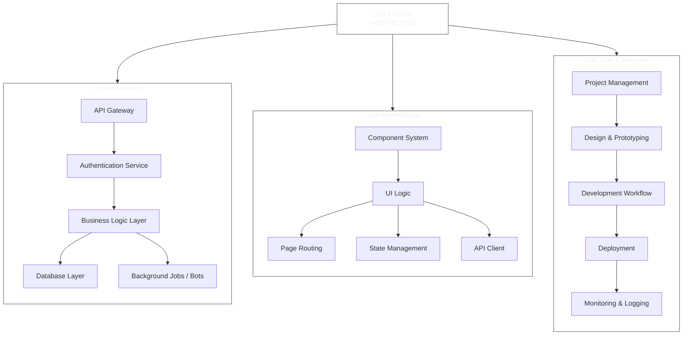

# 🚀 HOLYCANN • Full Stack Developer

<div align="center">


---

</div>

## üåê **SYSTEM ARCHITECTURE**


```mermaid
graph TD
    %% Root System
    A[🧠 SYSTEM ARCHITECTURE] --> Backend
    A --> Frontend
    A --> Platform

    %% Backend Layer
    subgraph Backend [‚ö° Backend Layer]
        direction TB
        B1[API Gateway]
        B2[Authentication Service]
        B3[Business Logic Layer]
        B4[Database Layer]
        B5[Background Jobs / Bots]

        B1 --> B2
        B2 --> B3
        B3 --> B4
        B3 --> B5
    end

    %% Frontend Layer
    subgraph Frontend [üé® Frontend Layer]
        direction TB
        F1[Component System]
        F2[UI Logic]
        F3[Page Routing]
        F4[State Management]
        F5[API Client]

        F1 --> F2
        F2 --> F3
        F2 --> F4
        F2 --> F5
    end

    %% Tools / Platform Layer
    subgraph Platform [üõ† Tools & Integration]
        direction TB
        P1[Project Management]
        P2[Design & Prototyping]
        P3[Development Workflow]
        P4[Git Versioning]
        P4[Deployment]
        P5[Monitoring & Logging]

        P1 --> P2 --> P3 --> P4 --> P5
    end

    %% Styling (minimal futuristic)
    classDef clean fill:none,stroke:#7f8c8d,stroke-width:1.5px,color:#ecf0f1,font-size:14px;
    class Backend,Frontend,Platform clean;
    class A clean;
```

---

## 🛠️ **TECHNOLOGY STACK** 

<div align="center">

## 🛠️ TECHNOLOGY STACK

### **‚ö° Core Development**


### **üî• Frameworks & Libraries**


### **🗄️ Database Systems**


### ⚙️ Platforms & CMS


### **üß∞ Tools & Workflow**


</div>

---

## üìä **PERFORMANCE DASHBOARD**

<div align="center">

### **‚ö° Development Statistics**


### **üî• Code Distribution Matrix**


### **üìà Contribution Activity**


</div>

---

## üöÄ **DEVELOPMENT PHILOSOPHY**

<div align="center">

```yaml
Core_Principles:
  - 🎯 Clean, Maintainable Code
  - ‚ö° Performance-First Approach
  - üîí Security by Design
  - üì± Mobile-Responsive Solutions
  - üåê Cross-Platform Compatibility

Innovation_Focus:
  - 🤖 Automated Testing & QA
  - üìä Data-Driven Architecture
  - 🔄 Continuous Integration
  - üìà Scalable System Design
```

</div>

---

## üåê **PROFESSIONAL NETWORK**

<div align="center">

[](https://linkedin.com/in/yourprofile)
[](https://yourportfolio.com)
[](mailto:your.email@domain.com)
[](https://github.com/holycann)

</div>

---

<div align="center">

### üí´ **Engineering the Future Through Code**


</div>

---

<div align="center">
<sub>🌟 Crafted with precision and passion • Always evolving, always improving 🌟</sub>
</div>
